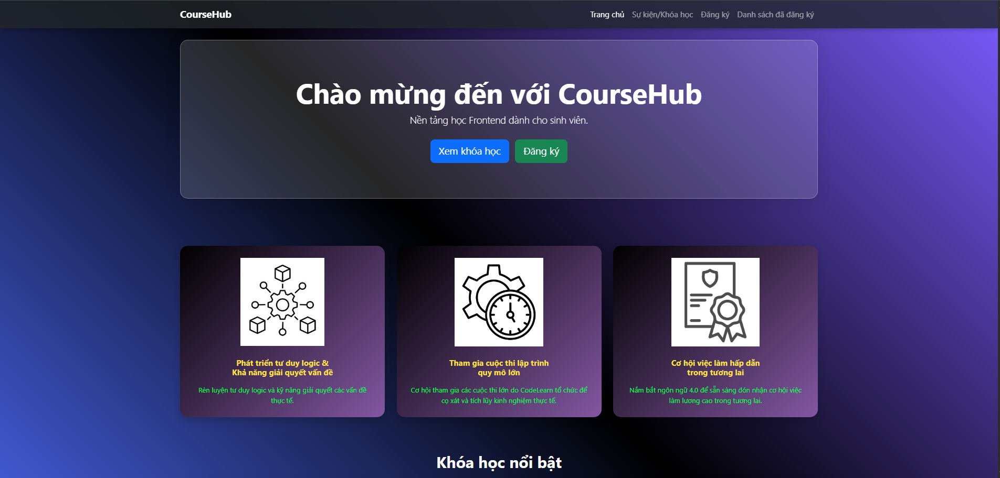
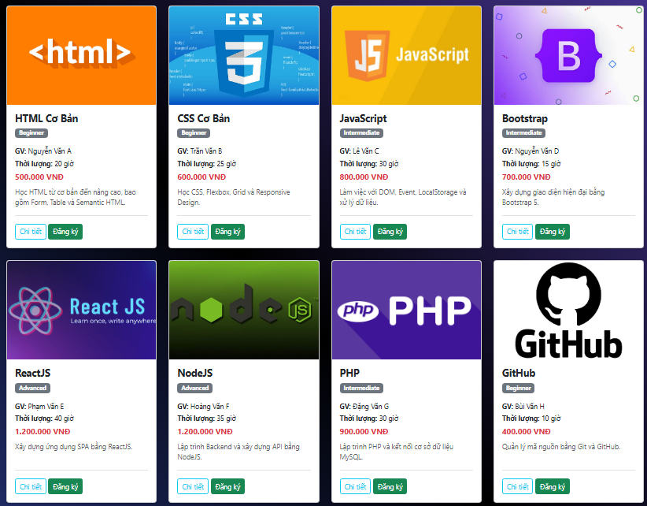

# [cite_start]CourseHub - Nền tảng học Frontend dành cho sinh viên [cite: 238]

## 1. Thông tin sinh viên
- **Họ và tên:** Trần Trọng Nghĩa 
- **MSSV:** 24210501025
- **Lớp:** 242101TH001

## 2. Mô tả ngắn website
[cite_start]CourseHub là một website tĩnh (frontend) dùng để giới thiệu và đăng ký các khóa học lập trình web[cite: 240]. Giao diện được thiết kế hiện đại với hiệu ứng kính mờ (Glassmorphism), mang lại trải nghiệm trực quan và thân thiện cho người dùng. Website được xây dựng hoàn toàn không sử dụng backend hay database, dữ liệu được quản lý trực tiếp trên trình duyệt web thông qua LocalStorage.

## 3. Danh sách chức năng
- **Trang chủ:** Hiển thị banner, lợi ích khóa học và danh sách các khóa học nổi bật.
- **Sự kiện/Khóa học:** Hiển thị toàn bộ danh sách khóa học. [cite_start]Có chức năng lọc khóa học theo cấp độ (Beginner, Intermediate, Advanced) và tìm kiếm theo tên khóa học.
- **Chi tiết khóa học:** Xem thông tin chi tiết (Giảng viên, Thời lượng, Giá, Mô tả) thông qua cửa sổ hiển thị nổi (Modal).
- **Form đăng ký:** Cho phép người dùng điền thông tin tham gia khóa học với tính năng kiểm tra dữ liệu đầu vào (Validation form) chặt chẽ bằng JavaScript.
- **Quản lý đăng ký:** Lưu trữ thông tin người dùng đã đăng ký bằng LocalStorage. [cite_start]Xem danh sách đã đăng ký, xóa từng đăng ký hoặc xóa toàn bộ danh sách.

## 4. Công nghệ sử dụng
- **HTML5 & CSS3:** Xây dựng bộ khung và thiết kế giao diện tùy chỉnh (Gradient, Glassmorphism).
- **JavaScript:** Xử lý tương tác DOM, tìm kiếm, lọc dữ liệu, xác thực form và LocalStorage.
- **Bootstrap 5:** Sử dụng Grid system, Navbar, Card, Modal để thiết kế giao diện responsive (tương thích mọi thiết bị) nhanh chóng.

## 5. Link GitHub Pages
[Xem Demo trực tiếp website tại đây] https://nghiatran0202.github.io/web-midterm-24210501025-TranTrongNghia/

## 6. Ảnh chụp giao diện
*

 

## 7. Hướng dẫn chạy local
Dự án là một website tĩnh hoàn toàn, bạn có thể chạy dự án trên máy tính cá nhân (local) theo các bước sau[cite: 245]: